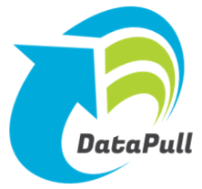

# DataPull #
<p align="center">
  
</p>
DataPull is a self-service Distributed ETL tool to join and transform data from heterogeneous datastores. It provides users an easy and consistent way to move data from one datastore to another. Supported datastores include, but are not limited to, SQLServer, MySql, Postgres, Cassandra, MongoDB, and Kafka.

## Features
1. JSON configuration-driven data movement - no Java/Scala knowledge needed
1. Join and transform data among heterogeneous datastores (including NoSQL datastores) using ANSI SQL
1. Deploys on Amazon AWS EMR and Fargate; but can run on any Spark cluster
1. Picks up datastore credentials stored in [Hashicorp Vault](https://www.vaultproject.io), [Amazon Secrets Manager](https://aws.amazon.com/secrets-manager/)
1. Execution logs and migration history configurable to Amazon AWS Cloudwatch, S3
1. Use built-in cron scheduler, or call REST API from external schedulers

... and many more features documented [here](https://github.com/homeaway/datapull/blob/master/core/src/main/resources/Samples/Input_Json_Specification.json)

## Run DataPull locally
> Note: DataPull consists of two services, an API written in Java Spring Boot, and a Spark app written in Scala. Although Scala apps can run on JDK 11, per [official docs](https://docs.scala-lang.org/overviews/jdk-compatibility/overview.html#jdk-11-compatibility-notes) it is recommended that Java 8 be used for compiling Scala code. The effort to upgrade to OpenJDK 11+ is tracked [here](https://github.com/homeaway/datapull/issues/2)

### Build and execute within a Dockerised Spark environment
> Pre-requisite: Docker Desktop
* Clone this repo locally and check out the master branch
  ```
  git clone git@github.com:homeaway/datapull.git
  ```
* build the Scala JAR from within the core folder
  ```
  cd datapull/core
  cp ./src/main/resources/application-dev.yml ./src/main/resources/application.yml
  docker run -e MAVEN_OPTS="-Xmx1024M -Xss128M -XX:MetaspaceSize=512M -XX:MaxMetaspaceSize=1024M -XX:+CMSClassUnloadingEnabled" --rm -v "${PWD}":/usr/src/mymaven -v "${PWD}/m2":/root/.m2 -w /usr/src/mymaven maven:3.6.3-jdk-8 mvn clean install
  ```
* Execute a sample JSON input file [Input_Sample_filesystem-to-filesystem.json](core/src/main/resources/Input_Sample_filesystem-to-filesystem.json) that moves data from a CSV file [HelloWorld.csv](core/src/main/resources/SampleData/HelloWorld.csv) to a folder of json files named SampleData_Json.  
  ```
  docker run -v $(pwd):/core -w /core -it --rm gettyimages/spark:2.2.1-hadoop-2.8 spark-submit --deploy-mode client --class core.DataPull target/DataMigrationFramework-1.0-SNAPSHOT-jar-with-dependencies.jar src/main/resources/Samples/Input_Sample_filesystem-to-filesystem.json local
  ```
* Open the relative path target/classes/SampleData_Json to find the result of the DataPull i.e. the data from target/classes/SampleData/HelloWorld.csv transformed into JSON.

### Build and debug within an IDE (IntelliJ) ###	
> Pre-requisite: IntelliJ with Scala plugin configured. Check out this [Help page](https://docs.scala-lang.org/getting-started-intellij-track/getting-started-with-scala-in-intellij.html) if this plugin is not installed.	
* Clone this repo locally and check out the master branch	
* Open the folder [core](core) in IntelliJ IDE.	
* When prompted, add this project as a maven project.	
* By default, this source code is designed to execute a sample JSON input file [Input_Sample_filesystem-to-filesystem.json](core/src/main/resources/Input_Sample_filesystem-to-filesystem.json) that moves data from a CSV file [HelloWorld.csv](core/src/main/resources/SampleData/HelloWorld.csv) to a folder of json files named SampleData_Json.	
* Go to File > Project Structure... , and choose 1.8 (java version) as the Project SDK	
* Go to Run > Edit Configurations... , and do the following	
    * Create an Application configuration (use the + sign on the top left corner of the modal window)	
    * Set the Name to Debug	
    * Set the Main Class as Core.DataPull	
    * Use classpath of module Core.DataPull	
    * Set JRE to 1.8	
    * Click Apply and then OK	
* Click Run > Debug 'Debug' to start the debug execution	
* Open the relative path target/classes/SampleData_Json to find the result of the DataPull i.e. the data from target/classes/SampleData/HelloWorld.csv transformed into JSON.

## Deploy DataPull to Amazon AWS

Deploying DataPull to Amazon AWS, involves
- installing the DataPull API and Spark JAR in AWS Fargate, using [this runbook](https://homeaway.github.io/datapull/install_on_aws/)
- running DataPulls in AWS EMR, using [this runbook](https://homeaway.github.io/datapull/emr_runbook/)

## Contribute to this project

### Bugs/Feature Requests

Please create an issue in this git repo, using the bug report or feature request templates.

### Documentation

DataPull documentation is available at https://homeaway.github.io/datapull/ . To update this documentation, please do the following steps...

1. Fork the [DataPull](https://github.com/homeaway/datapull) repo

1. In terminal from the root of the repo, run 
    1. if Docker is installed, run 
    ```
    docker run --rm -it -p 8000:8000 -v ${PWD}/docs:/docs squidfunk/mkdocs-material
    ```
    2. or, if MkDocs and Material for MkDocs are installed, run 
    ```
    cd docs
    mkdocs serve
    ```

1. Open http://127.0.0.1/8000 to see a preview of the documentation site. You can edit the documentation by following https://www.mkdocs.org/#getting-started

1. Once you're done updating the documentation, please commit and push your updates to your forked repo. 

1. In terminal from the root of the forked repo, run one of the following command blocks, to update and push your `gh-pages` branch.
    1. if Docker is installed, run 
    ```
    docker run --rm -it -v ~/.ssh:/root/.ssh -v ${PWD}:/docs squidfunk/mkdocs-material gh-deploy --config-file /docs/docs/mkdocs.yml
    ```
    2. or, if MkDocs and Material for MkDocs are installed, run 
    ```
    cd docs
    mkdocs gh-deploy
    ```

1. Create 2 PRs (one for forked repo branch that you updated, another for `gh-pages` branch) and we'll review and approve them.

Thanks again, for helping make DataPull better!
