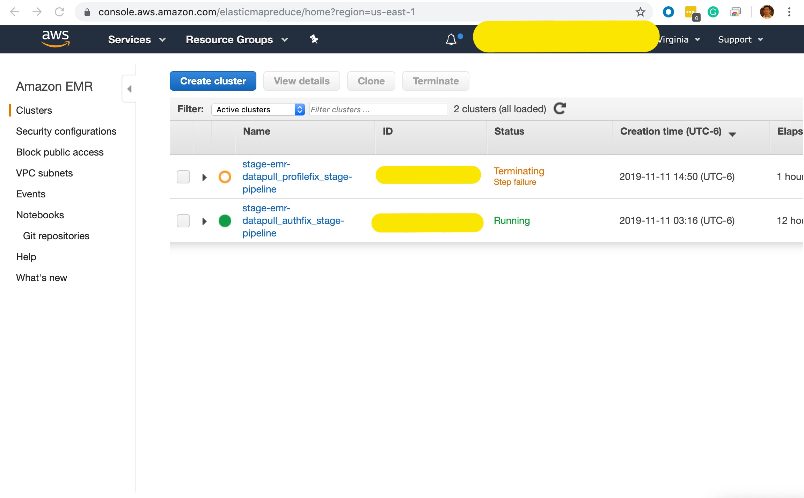
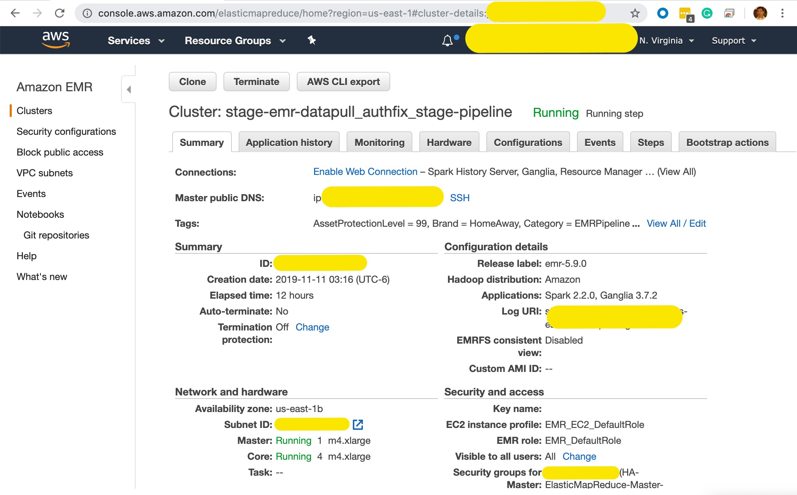
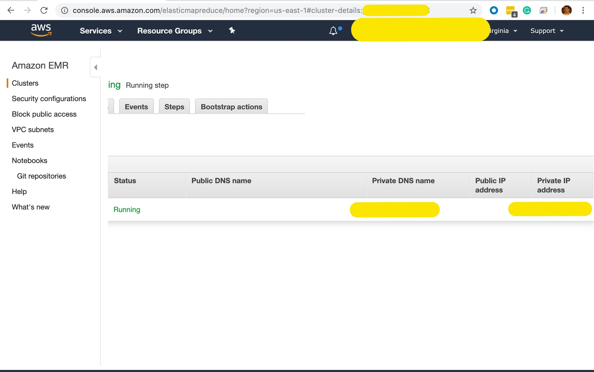
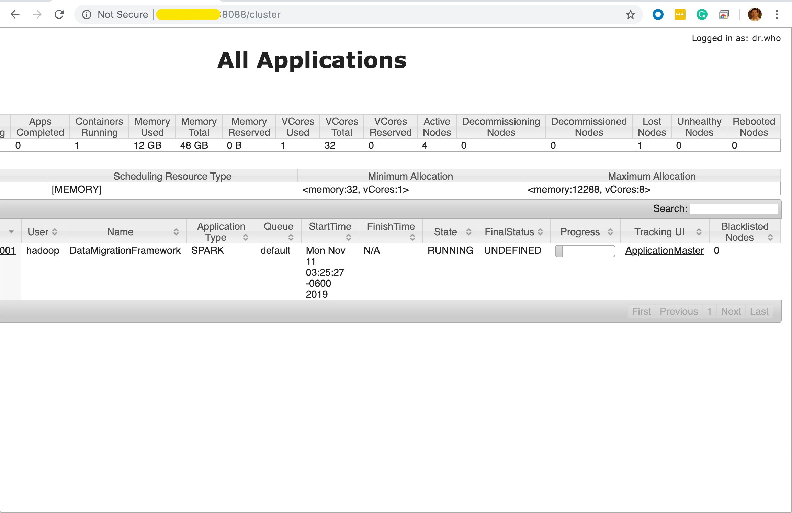
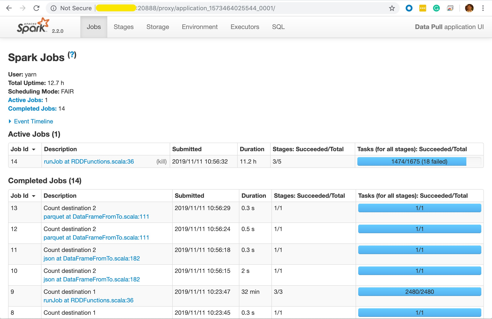

DataPull internally uses Spark to move data across platforms. DataPull jobs can be monitored using the Spark UI. 

> Spark UI is available only while the EMR cluster is in running status, and has a step in running status.

# Prerequisites

## Prerequisite for environments outside of Vrbo and EG Data Platform

The Spark UI is a website that is hosted on the master node of the EMR cluster running DataPull. If most cases, the IP/DNS Name of the EMR cluster's master is inaccessible from the client machine of the user; since there is no peering/VPN/Direct Connect set up from the user's network to the VPC of the EMR Cluster. Hence, it is necessary to use [SSH Tunnelling](https://www.ssh.com/ssh/tunneling/) to access this website on the user's client machine.


### Option 1 (recommended for more technical users)
Use an SSH client to connect to the master node, configure SSH tunneling with local port forwarding, and use an Internet browser to open web interfaces hosted on the master node. This method allows you to configure web interface access without using a SOCKS proxy. For more information, refer to https://docs.aws.amazon.com/emr/latest/ManagementGuide/emr-ssh-tunnel-local.html

### Option 2 (recommended for new users)
Use an SSH client to connect to the master node, configure SSH tunneling with dynamic port forwarding, and configure your Internet browser to use an add-on such as FoxyProxy or SwitchySharp to manage your SOCKS proxy settings. This method allows you to automatically filter URLs based on text patterns and to limit the proxy settings to domains that match the form of the master node's DNS name. The browser add-on automatically handles turning the proxy on and off when you switch between viewing websites hosted on the master node and those on the Internet. For more information, refer to https://docs.aws.amazon.com/emr/latest/ManagementGuide/emr-ssh-tunnel.html

## Prerequisite for Production env in Vrbo and EG Data Platform

To access EMR clusters' master nodes in Vrbo and EG Data Platform production environments, you need to be on [Vrbo Production VPN](prodvpn.homeawaycorp.com) and have Teleport. Follow [this page](https://wiki.homeawaycorp.com/pages/viewpage.action?spaceKey=Hostingopps&title=Teleport+Client) for steps on installing  Teleport and enabling teleport connection. 

> Pro Tip: The latest version: 4.1.4 of Teleport will be installed when you do `brew install teleport` which is unstable and not compatible with VRBO instead use this command:

```brew install https://raw.githubusercontent.com/igas/homebrew-core/87fa144e04b1b513196b581b958a508270e4aba6/Formula/teleport.rb```

# Steps to access Spark UI
1. Open the AWS console for environment in which the datapull job is running. select [EMR](https://console.aws.amazon.com/elasticmapreduce/home) under the 
      services tab.
      
1. Select the EMR cluster for the corresponding datapull job. The EMR Cluster will be named `<environment>-emr-<DataPull Pipeline Name>-pipeline`

1. Click the Hardware tab and Click the **ID** of the **Master** node which can recongnised under the **Node Type & name** tab.

1. Copy the `<Master Node Private IP Address>` to your clipboard. 
1. Open a new browser window/tab and browse to `http://<Master Node Private IP Address>:8088` which will open the **YARN ResourceManager**

1. Click on the link which says **ApplicationMaster** under the Tracking UI.
1. If the page redirection fails with **This page isn’t working** or **DNS Error**, and if the `<Master Node Private IP Address>` is 1.2.3.4 then replace `ip-1-2-3-4.ec2.internal` with `1.2.3.4` in the URL
1. You are now at th Spark UI. For understanding more on analyzing Spark UI, refer to [Understanding your Apache Spark Application Through Visualization](https://databricks.com/blog/2015/06/22/understanding-your-spark-application-through-visualization.html)


> To understand all the available web interfaces which can be accessed through `<Master Node Private IP Address>`, refer to [this page](https://docs.aws.amazon.com/emr/latest/ManagementGuide/emr-web-interfaces.html)